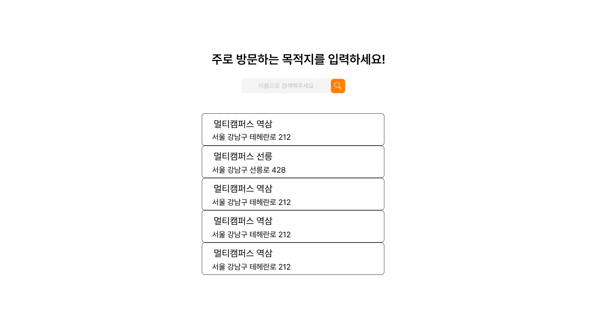
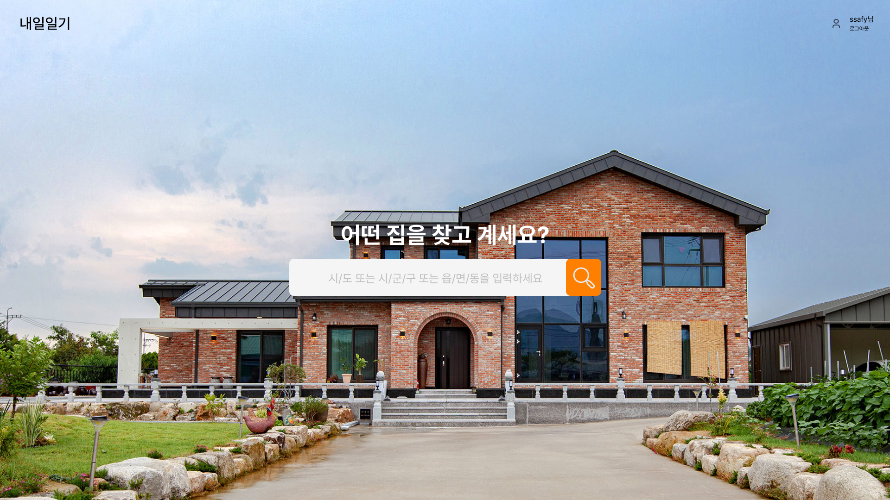

# T12S14_Final_Back_내일일기_정혜선_구본관
> 2024.11.20 ~ 2024.11.26 동안 진행

## 요구사항정의서
| 도메인        | 기능 명               |
|------------|-----------------------|
| `User`     | 회원가입              |
| `User`     | 카카오 로그인         |
| `User`     | 로그아웃              |
| `Address`  | 주소 검색             |
| `Facility` | 편의시설 조회         |
| `Facility` | 편의시설 상세 조회    |
| `house`    | 아파트 조회           |
| `house`    | 아파트 상세 조회      |
| `diary`    | 일기 생성             |
| `image`     | 이미지 저장           |

## ERD

## 클래스 다이어그램

## 화면 설계서
### 랜딩페이지

### 시작하기

### 회원가입-목적지

### 회원가입-이동수단

### 메인페이지

### 주택 조회 화면 1

### 주택 조회 화면 2

### 주택 상세 조회 화면

### 자주 방문하는 편의시설 선택 화면

### 내일일기 조회

### 내일일기 조회 요약
